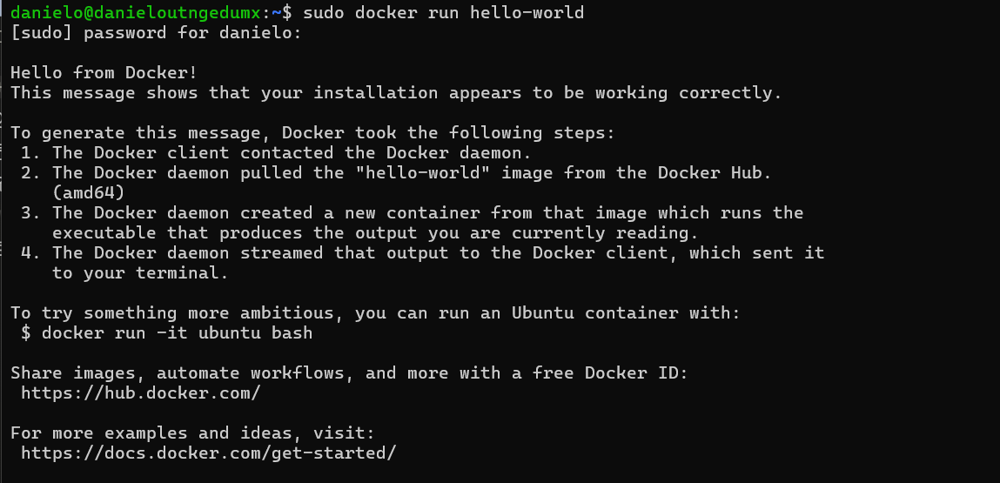
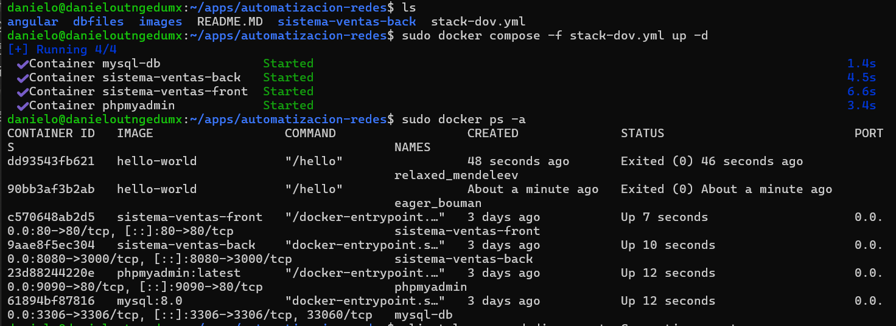

<p align="center">
  
</p>

# Universidad Tecnológica del Norte de Guanajuato

| Campo | Detalle |
|---|---|
| **Materia** | Automatización de Infraestructura Digital |
| **Unidad** | Unidad I – Entornos de desarrollo en la automatización de redes |
| **Carrera** | Ingeniería en Redes Inteligentes y Ciberseguridad |
| **Grupo** | GIRI6091 |
| **Alumno** | Daniel Ortega Vega |
| **Número de Control** | 1223100486 |
| **Fecha** | 29 de mayo de 2026 |

---

## Índice

1. [Introducción](#introducción)
2. [Desarrollo](#desarrollo)
   - [Descripción de Herramientas](#descripción-de-herramientas)
   - [Procedimiento de Instalación](#procedimiento-de-instalación)
   - [Evidencia de Verificación de Funcionamiento](#evidencia-de-verificación-de-funcionamiento)
3. [Conclusión](#conclusión)
4. [Bibliografía](#bibliografía)

---

## Introducción

El presente reporte documenta el proceso de instalación, configuración y despliegue de un entorno de desarrollo para la automatización de infraestructura de redes, correspondiente a la Unidad I de la materia Automatización de Infraestructura Digital. A lo largo de esta unidad se trabajó con herramientas ampliamente utilizadas en la industria del desarrollo de software y la administración de sistemas, específicamente Docker Engine, Docker Compose, Docker Swagger y Git, las cuales permiten crear entornos reproducibles, escalables y portables mediante el uso de contenedores.

La automatización de infraestructura es una práctica esencial en los entornos modernos de tecnología de la información, ya que permite reducir errores humanos, acelerar los tiempos de despliegue y garantizar la consistencia entre diferentes ambientes de desarrollo, pruebas y producción. Docker, en particular, se ha convertido en una de las plataformas de contenedorización más populares del mundo, permitiendo a los desarrolladores y administradores de sistemas empaquetar aplicaciones junto con todas sus dependencias en unidades portables llamadas contenedores.

Durante esta práctica se llevó a cabo el despliegue de una aplicación web compuesta por cuatro servicios: un frontend desarrollado en Angular servido a través de Nginx, un backend desarrollado en Node.js, una base de datos MySQL y una interfaz de administración de base de datos PhpMyAdmin. Todos estos servicios fueron orquestados mediante un archivo Docker Compose, demostrando la capacidad de levantar entornos complejos de forma automatizada con un solo comando. Este reporte explica cada paso del proceso, desde la instalación de las herramientas hasta la verificación del funcionamiento del entorno completo.

---

## Desarrollo

### Descripción de Herramientas

#### Docker Engine

Docker Engine es la plataforma de contenedorización de código abierto más utilizada en la industria. Permite empaquetar aplicaciones y sus dependencias dentro de contenedores ligeros y portables que pueden ejecutarse en cualquier sistema operativo que tenga Docker instalado. A diferencia de las máquinas virtuales, los contenedores comparten el kernel del sistema operativo anfitrión, lo que los hace mucho más eficientes en el uso de recursos.

Docker Engine consta de tres componentes principales:
- **Docker Daemon (`dockerd`):** El proceso que gestiona los contenedores, imágenes, redes y volúmenes.
- **Docker CLI:** La interfaz de línea de comandos que permite interactuar con el daemon.
- **Docker REST API:** La interfaz que permite a las aplicaciones comunicarse con el daemon.

```bash
# Verificar la versión instalada de Docker
docker --version
```

#### Docker Compose

Docker Compose es una herramienta que permite definir y gestionar aplicaciones multi-contenedor mediante un archivo de configuración en formato YAML (`.yml`). Con un solo archivo es posible describir todos los servicios, redes y volúmenes que conforman una aplicación, y levantarlos todos con un único comando.

Docker Compose es especialmente útil en entornos de desarrollo donde se necesita orquestar múltiples servicios que interactúan entre sí, como bases de datos, backends, frontends y herramientas de administración.

```bash
# Verificar la versión instalada de Docker Compose
docker compose version

# Levantar todos los servicios definidos en el archivo YML
docker compose -f archivo.yml up -d

# Ver el estado de los contenedores
docker compose -f archivo.yml ps

# Detener todos los servicios
docker compose -f archivo.yml down
```

#### Docker Swagger

Docker Swagger, basado en la especificación OpenAPI, es una herramienta que permite diseñar, documentar y visualizar APIs REST de forma interactiva directamente desde un contenedor Docker. A través de la imagen oficial **swaggerapi/swagger-ui** disponible en Docker Hub, es posible desplegar una interfaz web que muestra de manera clara todos los endpoints de una API, sus parámetros, tipos de datos y respuestas esperadas, sin necesidad de instalar nada adicional en el sistema anfitrión.

En el contexto de la automatización de infraestructura, Swagger resulta muy útil para documentar los servicios backend que forman parte de una arquitectura de microservicios, facilitando la colaboración entre equipos de desarrollo y la integración entre servicios.

#### Git

Git es el sistema de control de versiones distribuido más utilizado en el mundo. Permite rastrear los cambios en el código fuente, colaborar con otros desarrolladores y mantener un historial completo de modificaciones. En la práctica se utilizó Git para clonar el repositorio del proyecto base proporcionado por el profesor.

```bash
# Clonar un repositorio
git clone https://github.com/edomenzain/automatizacion-redes.git

# Verificar el estado del repositorio
git status

# Ver el historial de commits
git log --oneline
```

---

### Procedimiento de Instalación

#### Instalación de VSCode y Plugins

Visual Studio Code es el editor de código recomendado para esta materia. Se descargó desde el sitio oficial [https://code.visualstudio.com](https://code.visualstudio.com) y se instalaron los siguientes plugins:

- **Docker** (Microsoft): Permite gestionar contenedores e imágenes desde el editor.
- **Remote - SSH**: Permite conectarse a máquinas remotas vía SSH.
- **YAML**: Proporciona soporte de sintaxis para archivos `.yml`.
- **GitLens**: Mejora la integración con Git dentro del editor.

#### Instalación de Docker en Ubuntu 

**Paso 1: Actualizar los paquetes del sistema**
```bash
sudo apt update && sudo apt upgrade -y
```

**Paso 2: Instalar dependencias necesarias**
```bash
sudo apt install -y apt-transport-https ca-certificates curl gnupg lsb-release
```

**Paso 3: Agregar la clave GPG oficial de Docker**
```bash
curl -fsSL https://download.docker.com/linux/ubuntu/gpg | sudo gpg --dearmor -o /usr/share/keyrings/docker-archive-keyring.gpg
```

**Paso 4: Agregar el repositorio oficial de Docker**
```bash
echo "deb [arch=amd64 signed-by=/usr/share/keyrings/docker-archive-keyring.gpg] \
https://download.docker.com/linux/ubuntu $(lsb_release -cs) stable" | \
sudo tee /etc/apt/sources.list.d/docker.list > /dev/null
```

**Paso 5: Instalar Docker Engine**
```bash
sudo apt update && sudo apt install -y docker-ce docker-ce-cli containerd.io
```

**Paso 6: Instalar Docker Compose Plugin**
```bash
sudo apt install -y docker-compose-plugin
```

**Paso 7: Agregar el usuario al grupo docker**
```bash
sudo usermod -aG docker $USER
newgrp docker
```

**Paso 8: Verificar la instalación**
```bash
docker --version
docker compose version
```

#### Instalación de Git

```bash
sudo apt install -y git
git --version
git config --global user.name "Daniel Ortega Vega"
git config --global user.email "correo@ejemplo.com"
```

---

### Evidencia de Verificación de Funcionamiento

#### Verificación de Docker con Hello-World

Para confirmar que Docker Engine quedó correctamente instalado se ejecutó la imagen oficial `hello-world`:

```bash
sudo docker run hello-world
```

<p align="center">
  
</p>

#### Ejecución del Archivo YML y Verificación de Contenedores

```bash
cd ~/apps/automatizacion-redes
sudo docker compose -f stack-dov.yml up -d
sudo docker ps -a
```

<p align="center">
  
</p>

---

## Conclusión

A lo largo del desarrollo de esta primera unidad de Automatización de Infraestructura Digital, se adquirió experiencia práctica en el uso de Docker como plataforma de contenedorización, Docker Compose como herramienta de orquestación de servicios y Git como sistema de control de versiones. El despliegue de la aplicación Sistema de Ventas representó un reto técnico que implicó resolver problemas reales como la incompatibilidad del protocolo de autenticación de MySQL 8.0 con clientes antiguos, la comunicación entre contenedores en redes Docker y la configuración correcta de Nginx como servidor web para aplicaciones Angular.

El resultado final fue el levantamiento exitoso de cuatro contenedores interconectados que conforman una aplicación web completa: base de datos MySQL, interfaz de administración PhpMyAdmin, API REST en Node.js y frontend en Angular, todo orquestado con un único archivo Docker Compose. Este proceso demostró el valor real de la automatización de infraestructura, ya que una aplicación que normalmente requeriría horas de configuración manual puede desplegarse en minutos gracias a los contenedores.

Entre los hallazgos más importantes se destaca la importancia de definir redes personalizadas en Docker Compose para garantizar la comunicación entre servicios, así como la necesidad de considerar la compatibilidad entre versiones al trabajar con imágenes de base de datos. Esta unidad sienta las bases para comprender cómo las organizaciones modernas despliegan y gestionan sus aplicaciones en entornos de producción.

---

## Bibliografía

Docker Inc. (2024). *Descripción general de Docker Engine*. Documentación oficial de Docker.
https://docs.docker.com/engine/

Docker Inc. (2024). *Descripción general de Docker Compose*. Documentación oficial de Docker.
https://docs.docker.com/compose/

Docker Inc. (2024). *Imágenes oficiales en Docker Hub*. Docker Hub.
https://hub.docker.com/

Docker Inc. (2024). *Instalación de Docker Engine en Ubuntu*. Documentación oficial de Docker.
https://docs.docker.com/engine/install/ubuntu/

Git SCM. (2024). *Documentación oficial de Git*. Git.
https://git-scm.com/doc

GitHub Docs. (2024). *Introducción a GitHub*. GitHub.
https://docs.github.com/es

SmartBear Software. (2024). *Swagger UI: Herramientas de documentación y diseño de APIs*. Swagger.
https://swagger.io/tools/swagger-ui/

Node.js Foundation. (2024). *Documentación oficial de Node.js*. Node.js.
https://nodejs.org/es/docs

Nginx Inc. (2024). *Documentación oficial de Nginx*. Nginx.
https://nginx.org/en/docs/

MySQL. (2024). *Documentación oficial de MySQL 8.0*. Oracle.
https://dev.mysql.com/doc/refman/8.0/en/
